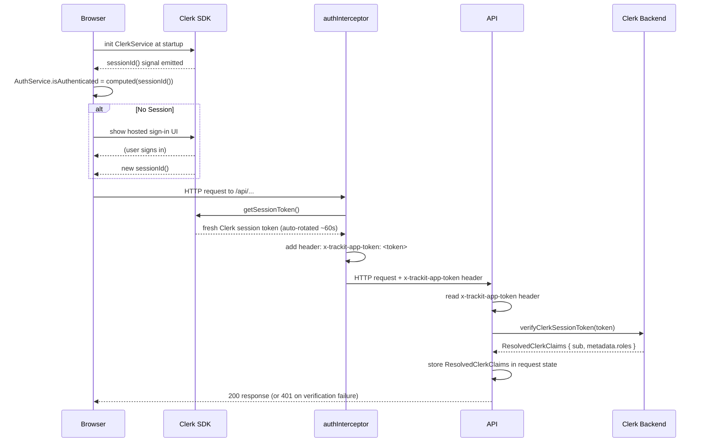

# Auth Flow (TrackIt)

This document describes how authentication works across the Angular frontend and Azure Functions API.

## Actors and Tokens

- **Clerk session token**: Issued by Clerk for the signed-in browser session. Used for all authenticated API calls. The Clerk browser SDK manages token rotation automatically (~60 s interval).

There is no TrackIt-issued app JWT. The Clerk session token is the sole auth credential.

## Frontend Flow

1. `main.ts` initializes `ClerkService` at application startup via `provideAppInitializer`.
2. `ClerkService` loads Clerk's `@clerk/ui` browser bundle before calling `clerk.load({ ui })`; this is required for hosted UI methods such as `mountSignIn`.
3. `LoginComponent` mounts Clerk's hosted sign-in UI when there is no active Clerk session.
4. Once Clerk reports an active session, `AuthService.isAuthenticated()` becomes `true` and the user lands in the app — no secondary API call required.
5. On the first authenticated API call, `authMiddleware` upserts a role-free Cosmos `users` projection from the Clerk profile.
6. `returnUrl` behavior is preserved: the auth guard redirects to `/login?returnUrl=...` on 401 and restores the URL after sign-in.

## Frontend Auth State

- `AuthService.isAuthenticated()` is a computed signal derived from `ClerkService.sessionId()`.
- `AuthService.appUser` is a computed signal populated from `ClerkService` signals (`userId`, `userEmail`, `userName`, `userPicture`).
- No token is stored in `localStorage`. No expiry timer or refresh logic exists in the frontend.

## Auth Interceptor Behavior

`authInterceptor` fetches a fresh Clerk session token and attaches it to outbound API requests:

- Only same-origin `/api/*` requests are modified.
- Requests that already include an `x-trackit-app-token` header are left unchanged.
- Header added: `x-trackit-app-token: <clerk_session_token>`.
- Token is retrieved via `ClerkService.getSessionToken()` on every request; the Clerk SDK handles rotation transparently.
- `Authorization` is intentionally not used: Azure Static Web Apps intercepts and mangles that header before the request reaches the Azure Functions backend.

### Sequence Diagram

## API Flow

### Protected endpoints

1. Read the `x-trackit-app-token` header.
2. Call `authorize()`, which calls `verifyClerkSessionToken()` from `@clerk/backend`.
3. On success, fetch the Clerk user profile and upsert the Cosmos `users` projection for app-local display/bookkeeping.
4. Store the resolved `ResolvedClerkClaims` (including `sub` and `metadata.roles`) in request state for downstream handlers.
5. On failure, returns `401`.

### Admin endpoints

1. Run standard `authorize()` first.
2. Call `requireAdmin()`, which checks that `metadata.roles` includes `"admin"`.
3. Returns `403` if the claim is absent.

The `metadata.roles` claim is embedded in the Clerk session token via a Clerk JWT template configured in the Clerk Dashboard. Roles are set on users via `publicMetadata` — also in the Clerk Dashboard.

### Participant-level access control

Manager/viewer access is enforced by the participant middleware via a live DB lookup. This is intentional: participant link revocation must take effect immediately, and the Clerk token rotation window (~60 s) is not acceptable latency for access revocation.

## Required Environment Variables

### Frontend

- `clerkPublishableKey` in `frontend/src/environments/environment*.ts`

### API

- `CLERK_SECRET_KEY`
- `CLERK_JWT_KEY` (optional — enables networkless token verification)
- `CLERK_AUTHORIZED_PARTIES` (optional — comma-separated origin allowlist)
- `COSMOS_ENDPOINT`
- `COSMOS_KEY`
- `COSMOS_DATABASE`
- `COSMOS_USERS_CONTAINER`

## Notes and Gotchas

- There are no `/api/auth/login` or `/api/auth/refresh` endpoints. The auth exchange layer has been removed.
- Cosmos `users` documents are app-local projections and do not store roles.
- Admin role assignment is a Clerk Dashboard operation, not a TrackIt code change.
- Participant access revocation bypasses the token rotation window because it uses a live DB lookup on every request.
