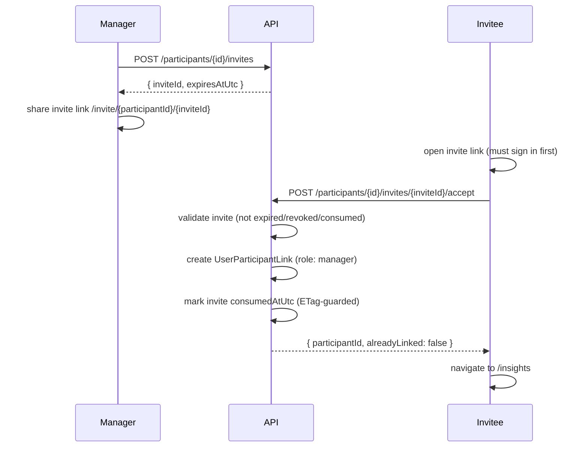

# Participant Association (TrackIt)

This document describes the architecture for participant association across the Angular frontend and Azure Functions API.

## Overview
Participants are non-user entities that parents track data for. A user can be linked to multiple participants with a role that controls edit permissions.

## Data Model (Cosmos DB)
Containers and partition keys:
- `participants` (partition key: `/id`)
- `userParticipantLinks` (partition key: `/userId`)

Shapes:
```ts
export type ParticipantDocument = {
  id: string;
  displayName?: string;
  birthDate?: string; // YYYY-MM-DD
  ageYears?: number | null; // derived from birthDate for responses
  createdAtUtc: string;
  createdByUserId: string;
};

export type UserParticipantLinkDocument = {
  id: string; // `${userId}:${participantId}`
  userId: string;
  participantId: string;
  role: 'manager' | 'viewer';
  createdAtUtc: string;
};
```

## API Surface
All endpoints require a valid Clerk session token (passed as `x-trackit-app-token` header).

### `POST /api/participants`
Creates a participant and a manager link for the current user.

Request:
```json
{ "displayName": "Avery", "birthDate": "2016-04-12" }
```

Response:
```json
{
  "id": "participant_...",
  "displayName": "Avery",
  "birthDate": "2016-04-12",
  "ageYears": 9,
  "createdAt": "...",
  "createdByUserId": "user_123"
}
```

Validation:
- `birthDate` is required and must be `YYYY-MM-DD`.
- `birthDate` cannot be in the future.

### `GET /api/participants`
Lists participants linked to the current user. Response includes role from the link.

Response:
```json
{
  "items": [
    {
      "id": "participant_...",
      "displayName": "Avery",
      "birthDate": "2016-04-12",
      "ageYears": 9,
      "createdAt": "...",
      "createdByUserId": "user_123",
      "role": "manager"
    }
  ],
  "nextToken": null
}
```

### `GET /api/participants/{id}`
Returns participant details if the user is linked. Response includes role.

### `PATCH /api/participants/{id}`
Updates participant fields. Requires the user to have `role: manager` on the link.

Request:
```json
{ "displayName": "Avery K", "birthDate": "2015-04-12" }
```

Response:
```json
{
  "id": "participant_...",
  "displayName": "Avery K",
  "ageYears": 10,
  "birthDate": "2015-04-12",
  "createdAt": "...",
  "createdByUserId": "user_123",
  "role": "manager"
}
```

Validation:
- `birthDate` (if provided) must be `YYYY-MM-DD` and not in the future.
- At least one field must be provided.

## Frontend Flow
- After sign-in, `ActiveParticipantGuard` checks `/api/participants`.
  - If none linked → redirect to `/setup` (participant creation wizard).
  - If exactly one → auto-select and proceed.
  - If multiple → present a participant picker (not yet implemented).
- `/setup` — three-step wizard: welcome → participant form → optional medication → success.
- Participant detail and edit are embedded in `/profile` (manager role only).

### Invite Acceptance Flow



## Active Participant State
Active participant is stored in-memory (signal state) and surfaced via `ParticipantService.activeParticipantId`.
The selection is not persisted in browser storage. Logging out or reloading the app clears the active participant state.

## Roles
Two distinct role concepts:
- User role (e.g., `parent`) is global to the account.
- Link role (`manager`/`viewer`) is scoped to a specific participant and gates edit access.

## Known Gaps / Future Work
- Delete behavior (soft vs hard).
- Shared participants / invites.
